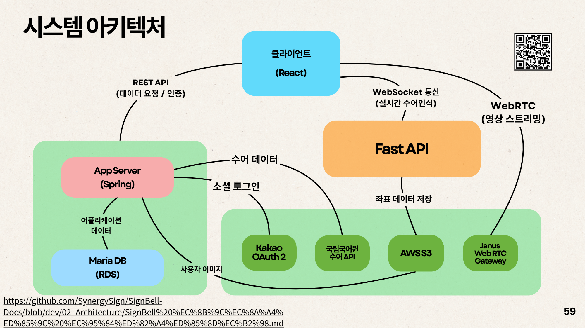
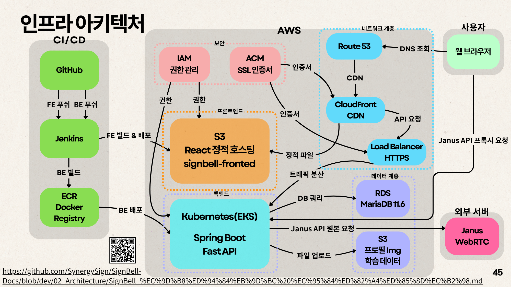
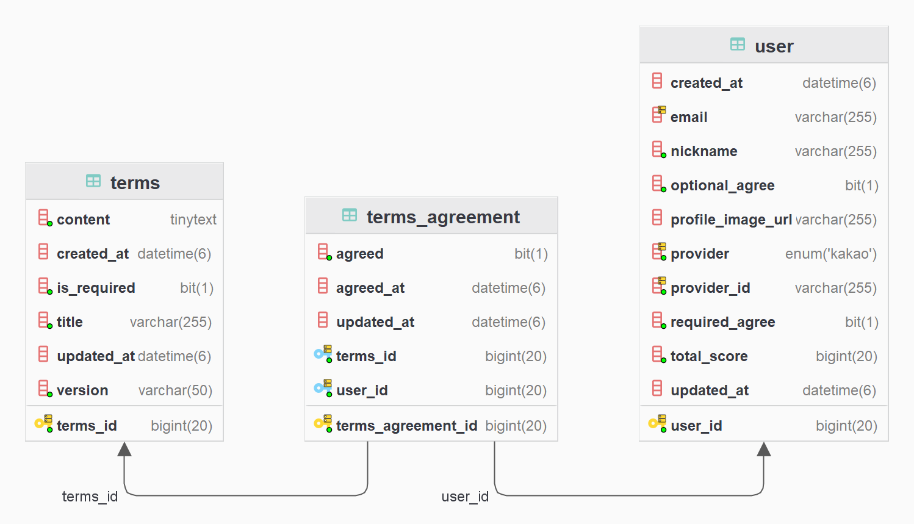
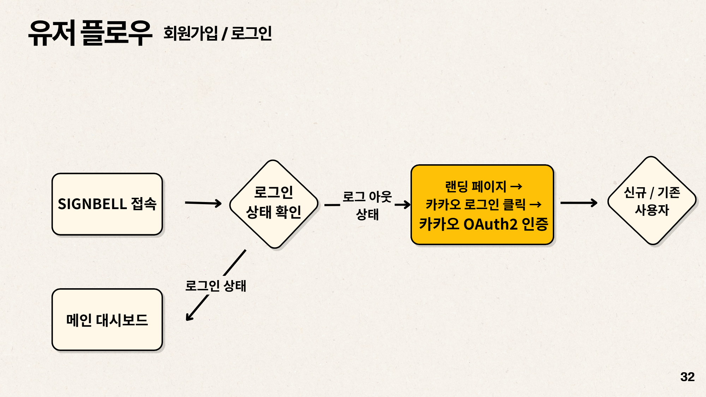
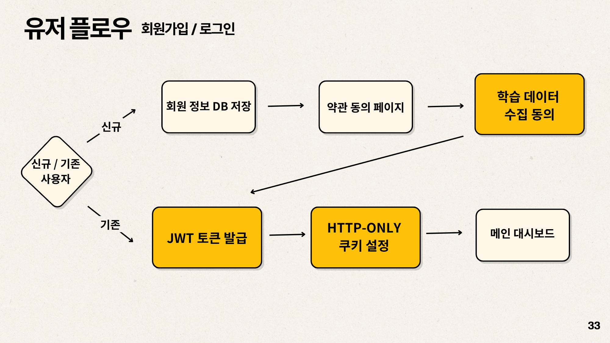

# 🔔 SignBell

> AI 기반 실시간 양방향 수어 학습 플랫폼

## 개인 [](https://github.com/songkey06)
## 프로젝트 [](https://github.com/SynergySign)

---

## 📋 프로젝트 개요 및 주요 기여

**SignBell**은 **AI 기반 실시간 양방향 수어 학습 플랫폼**으로, WebRTC를 통한 실시간 수어 인식 및 게이미피케이션 퀴즈를 제공하여 학습의 재미와 몰입도를 극대화했습니다. 프로젝트의 핵심 목표는 기술을 통해 청인과 농인 간의 소통 장벽을 허물고 포용적 사회에 기여하는 것입니다. 5주간 5인 풀스택 팀으로 진행되었으며, 저는 **보안과 인프라**를 담당하여 서비스의 안정적인 기반을 구축하는 데 집중했습니다.

저의 주요 기여는 다음과 같습니다:

1.  **철저한 인증/보안 시스템 구축**: **Spring Security**를 커스터마이징하고 **카카오 OAuth2** 및 **JWT 인증 시스템**을 통합 구현했습니다. 특히, **Access Token (15분)**과 **Refresh Token (7일) 구조**를 설계하고, Refresh Token을 **`HttpOnly` 쿠키**로 관리하여 XSS 공격으로부터 토큰을 보호하는 **보안 중심의 토큰 관리 전략**을 적용했습니다.
2.  **안정적인 상태 관리 및 재발급 로직**: 프론트엔드와 협업하여 **Axios 인증 인터셉터**를 구현하고, 토큰 만료 시 **자동 재발급 로직**이 실행되도록 하여 사용자 경험을 개선했습니다.
3.  **데이터 및 프로필 관리**: 사용자의 프로필 CRUD 및 필수 약관 동의 여부 등 마이페이지 관련 백엔드 API를 완성하고, **AWS S3**를 연동하여 프로필 이미지 업로드 기능을 구현했습니다.
4.  **초기 인프라 기반 마련**: **AWS EC2/RDS(MariaDB)/S3**를 기반으로 초기 배포 환경을 구축하고, 보안 그룹 설정 및 기본 Docker 환경을 구성하여 서비스의 안정적인 운영 기반을 마련했습니다.


---

## 🛠 기술 스택

### Backend


### Database


### Infrastructure


### Frontend (협업)


### AI (연동)


---

## 🏗 시스템 아키텍처



### 주요 구성 요소

- **클라이언트 (React)**: REST API 및 WebSocket을 통한 서버 통신
- **AppServer (Spring Boot)**: 
  - 사용자 인증/인가 (Spring Security + JWT)
  - 마이페이지 API (프로필, 약관 동의)
  - 카카오 OAuth2 통합
- **FastAPI**: 실시간 수어 인식 AI 모델 서빙 및 WebRTC 영상 스트리밍
- **MariaDB (RDS)**: 사용자 정보 및 학습 데이터 저장
- **AWS S3**: 프로필 이미지 저장소
- **국립국어원 수어 API**: 표준 수어 데이터 연동

---

## ⚙️ 배포 및 인프라 아키텍처



### 주요 구성 요소 


---

## 💡 주요 기능

### 1️⃣ 인증/보안 시스템

| 기능 | 설명 |
|------|------|
| **JWT 토큰 구조** | Access Token (15분) / Refresh Token (7일) 분리 설계 |
| **자동 재발급** | Access Token 만료 시 Refresh Token으로 자동 재발급 |
| **Spring Security 커스터마이징** | JWT 검증 필터 추가, 페이지별 권한 제어 |
| **카카오 OAuth2 연동** | 소셜 로그인을 통한 간편 회원가입/로그인 |
| **Zustand 전역 상태 관리** | 사용자 인증 상태 및 약관 동의 여부 관리 |
| **페이지별 접근 제어** | 로그인/약관 동의 여부에 따른 자동 리다이렉트 |

#### 🔐 인증 흐름

```
1. 사용자 카카오 로그인 → OAuth2 인증
2. Spring Security에서 JWT 발급 (Access + Refresh Token)
3. 프론트엔드에서 Zustand로 인증 상태 관리
4. Access Token 만료 시 401 에러 → Refresh Token으로 자동 재발급
5. 로그인/약관 동의 여부 확인 후 페이지 접근 제어
```

---

### 💾 데이터 모델 (논리 ERD)


---

### 인증/인가의 유저플우


### 2️⃣ 마이페이지 기능

| API | 설명 |
|-----|------|
| `GET /api/my-page/users/{userId}/profile` | 사용자 프로필 조회 |
| `PATCH /api/my-page/users/{userId}/profile` | 프로필 정보 수정 (닉네임, 필수약관 동의=true) |
| `PATCH /api/my-page/users/{userId}/terms-agreement` | 선택 약관 동의 여부 수정 |


### 3️⃣ AWS 배포 환경

| 구성 요소 | 설명 |
|----------|------|
| **EC2** | Amazon Linux + Docker + Nginx |
| **RDS** | MariaDB 인스턴스, 보안그룹 설정 |
| **S3** | 사용자 프로필 이미지, 좌표데이터 저장 |
| **Docker** | 컨테이너 기반 배포 자동화 |

## 🚧 기술적 도전과 해결

### 1️⃣ 401 에러가 아닌 404 에러 발생 문제

**문제**: 인증이 필요한 요청 경로가 permitAll() 범위에 포함되어, JWT 필터가 작동했음에도 SecurityContext에 인증 객체를 설정하지 못했기 때문에 토큰 만료 시 예상한 401 에러가 아닌 404 에러 발생 → Access Token 재발급 실패

**해결**: 
```java
// SecurityConfig 수정
http.authorizeHttpRequests(auth -> auth
    .requestMatchers("/api/auth/**", "/oauth2/**").permitAll()
    .anyRequest().authenticated()
)
```
필요한 엔드포인트만 열어서 401 에러가 정상적으로 발생하도록 수정

### 2️⃣ 카카오 OAuth2 문서 적용의 어려움

**문제**: 카카오 디벨로퍼스 문서를 실제 프로젝트에 적용하는 과정에서 어려움

**해결**: 
- Spring Security OAuth2 공식 문서 및 예제 분석
- OAuth2 인증 흐름 이해: Authorization Code Grant 방식 학습
- 향후 구글, 네이버 등 다른 소셜 로그인 확장 가능한 구조로 설계

### 3️⃣ 로컬 스토리지 vs Zustand 상태 관리

**문제**: 편의와 새로고침 시 로그인 유지를 위해 로컬 스토리지 사용 → 쿠키 완료 후에도 로그인 유지되는 문제

**해결**: 초기에는 편의성을 위해 Access Token을 로컬 스토리지에 저장했으나, XSS(Cross-Site Scripting) 공격에 취약해지는 보안 문제와 쿠키 만료 후에도 토큰이 잔존하는 인증 불일치 문제를 확인했습니다.
이를 해결하기 위해 Refresh Token을 HttpOnly 쿠키로 관리하고, Access Token은 메모리 상의 Zustand로 관리하도록 변경했습니다. 이는 인증 상태의 일관성을 유지하고, 토큰을 클라이언트 측 스크립트로부터 보호하는 보안적인 설계를 적용한 결과입니다.

**Zustand로 전역 상태 관리로 변경하여 일관된 인증 상태 유지**
```javascript
// Zustand를 활용한 중앙 집중식 상태 관리
const useAuthStore = create((set) => ({
  isAuthenticated: false,
  user: null,
  termsAgreed: false,
  setAuth: (data) => set({ ...data }),
  clearAuth: () => set({ isAuthenticated: false, user: null })
}))
```


## 📊 성과 및 배운 점

### 💼 개발 성과

- **보안 중심 설계**: JWT + OAuth2 통합 인증 시스템 구축
- **자동화**: Access Token 자동 재발급으로 사용자 경험 개선
- **확장 가능한 구조**: 다른 소셜 로그인 추가 가능한 OAuth2 통합 구조
- **전역 상태 관리**: Zustand로 프론트엔드 상태 관리 최적화
- **AWS 클라우드 경험**: EC2/RDS/S3 기반 배포 환경 구축

### 📚 기술적 학습

> "보안 시스템은 단순히 로그인 기능이 아니라, 서비스의 신뢰를 설계하는 과정"

- **Spring Security 심화**: 필터 체인 커스터마이징, JWT 검증 로직 구현
- **OAuth2 이해**: Authorization Code Grant 방식의 동작 원리 학습
- **토큰 관리 전략**: Access/Refresh Token 분리 및 재발급 로직
- **REST API 설계**: 프론트엔드 협업을 위한 명확한 API 문서화의 중요성
- **클라우드 인프라**: AWS 서비스 통합 및 배포 자동화 기초

### 🔜 향후 개선 사항

- [ ] Jenkins CI/CD 파이프라인 구축 (Docker 빌드 → 자동 배포)
- [ ] 구글, 네이버 등 추가 소셜 로그인 연동
- [ ] Refresh Token Rotation 전략 도입 (보안 강화)
- [ ] Redis를 활용한 토큰 블랙리스트 관리
- [ ] API 문서 자동화 (Swagger/Spring REST Docs)

## 👥 팀 구성

- 송민재 (본인):
  - BE: Spring Security (OAuth2, JWT) 기반 인증 시스템 및 마이페이지 API 개발
  - FE: 로그인/마이페이지 및 Axios 인증 인터셉터 구현
  - Infra: 초기 AWS 배포 지원 (EC2, RDS, S3 보안그룹 연동 등)
  - Docs: 기술 스택, 버전 스택 검토, 팀/시장 분석 및 KPI 작성

- 신동준:
  - FE: 프론트엔드 아키텍처, 컴포넌트 및 상태 관리 (Zustand) 설계, 전체적인 UI/UX 총괄
  - Infra: AWS (EKS, RDS, S3), 쿠버네티스, 도커, 젠킨스 등 인프라 구축 및 CI/CD 파이프라인 총괄
  - Docs: 프로젝트 개요, 기획 전략, 와이어프레임 기획 배경 및 줄거리, ERD, Git hub 관리

- 고동현:
  - BE: 실시간 퀴즈 게임 엔진 (WebSocket) 및 동시성 타이머 로직 개발
  - FE: 퀴즈 게임방 및 WebSocket, WebRTC, FastAPI 연동
  - AI/ML: 실사용 데이터셋 구축 (촬형) 및 초기 모델 검증 지원
  - Docs: 시장 분석, ERD, WebSocket API 등 문서 작성

- 강관주:
  - BE: 퀴즈방 REST API, 퀴즈 대기방 WebSocket 기능 개발
  - FE: 퀴즈 대기방 및 WebSocket, WebRTC 실시간 상태 동기화
  - AI/ML: 실사용 데이터셋 구축 (촬형) 및 초기 모델 검증 지원
  - Infra: S3 연동 및 EC2/RDS 배포 지원
  - Docs: 유저 플로우, 기능 요구사항, RestAPI 명세서 등 문서 작성

- 백승현:
  - AI/ML: FastAPI 추론 서버 및 AI 모델 개발/학습 (CNN+BiLSTM+Attention)
  - FE: 개인 수어 학습 페이지 및 AI 서버 연동 개발
  - BE: 개인 학습 콘텐츠 API (검색, CRUD) 개발, 국립국어원 수어 API
  - Docs: AI/ML, FastAPI 관련 문서 작성

## 📂 Repository

SignBell프로젝트의 각 레포지토리로 가려면 클릭
- **MonoRepository**: [SignBell Service Server](https://github.com/SynergySign/SignBell-App)
- **FastAPI**: [SignBell FastAPI Server](https://github.com/SynergySign/SignBell-FASTAPI)
- **AI**: [SignBell AI Server](https://github.com/SynergySign/SignBell-ML)
- **Docs**: [SignBell Docs Repository](https://github.com/SynergySign/SignBell-Docs)

## 📞 Contact

- **Email**: mjsong0524@gmail.com
- **GitHub**: [songkey06](https://github.com/songkey06)


---

⭐ **이 프로젝트가 도움이 되었다면 Star를 눌러주세요!**
